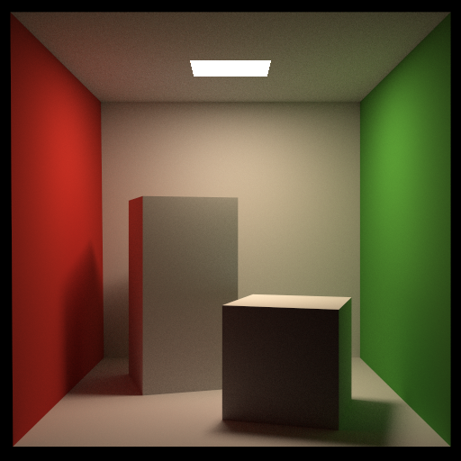
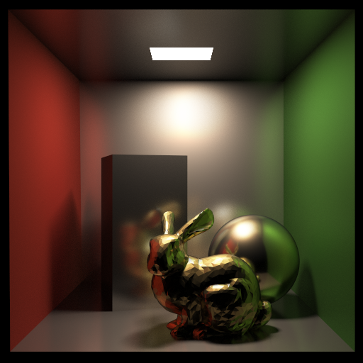
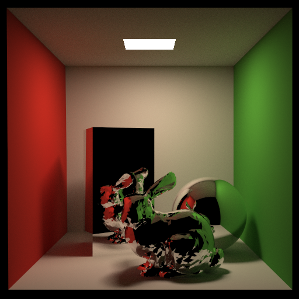
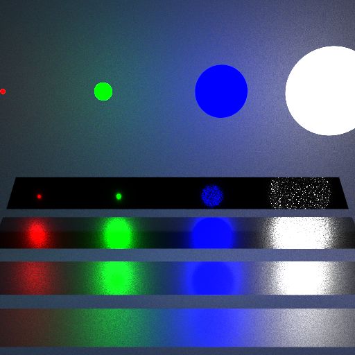
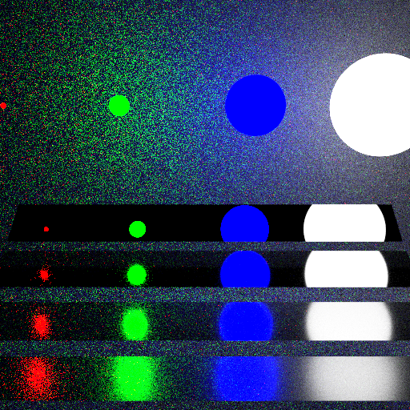
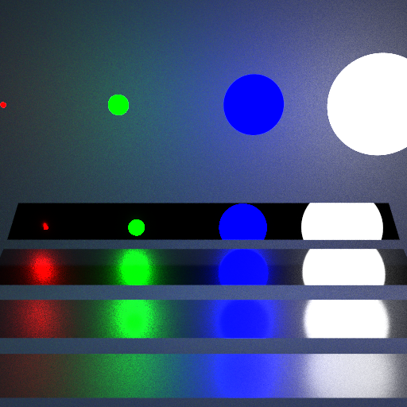

# Small Path Tracer

## Features

- Monte Carlo Path Tracing
- Russian Roulette
- MultiSampling Anti-Aliasing (MSAA)
- Bounding Volume Hierarchy (BVH)
- Mircofacet Model
- Importance Sampling
- Multiple Importance Sampling (MIS)
- Multithreading

## Running
```
mkdir build
cd build
cmake -G "MinGW Makefiles" .. (first time on VS2022) / cmake ..
make 
./RayTracing
```

## Results

<div style="display: flex; justify-content: space-between;">
  <div>
    
    <center><p>Diffuse, spp=1024</p></center>
  </div>
  <div>
    
    <center><p>Microfacet, spp=1024</p></center>
  </div>
  <div>
    
    <center><p>Mirror, spp=1024</p></center>
  </div>
</div>

<div style="display: flex; justify-content: space-between;">
  <div>
    
    <center><p>Sampling the light sources, spp=128</p></center>
  </div>
  <div>
    
    <center><p>Sampling the BRDF, spp=128</p></center>
  </div>
  <div>
    
    <center><p>MIS, spp=128</p></center>
  </div>
</div>


## Acknowledgement

The code is based on *[GAMES101](https://sites.cs.ucsb.edu/~lingqi/teaching/games101.html)*, *[GAMES202](https://sites.cs.ucsb.edu/~lingqi/teaching/games202.html)*, *[Ray Tracing in One Weekend Book Series](https://github.com/RayTracing/raytracing.github.io)*, *[Howl's Blog](https://howl144.github.io/2023/09/30/00014.%20Games101%20FinalProject/#shadowing-masking-function)* and *[YANGTHEKING](https://blog.csdn.net/ycrsw/article/details/124408789)*.
